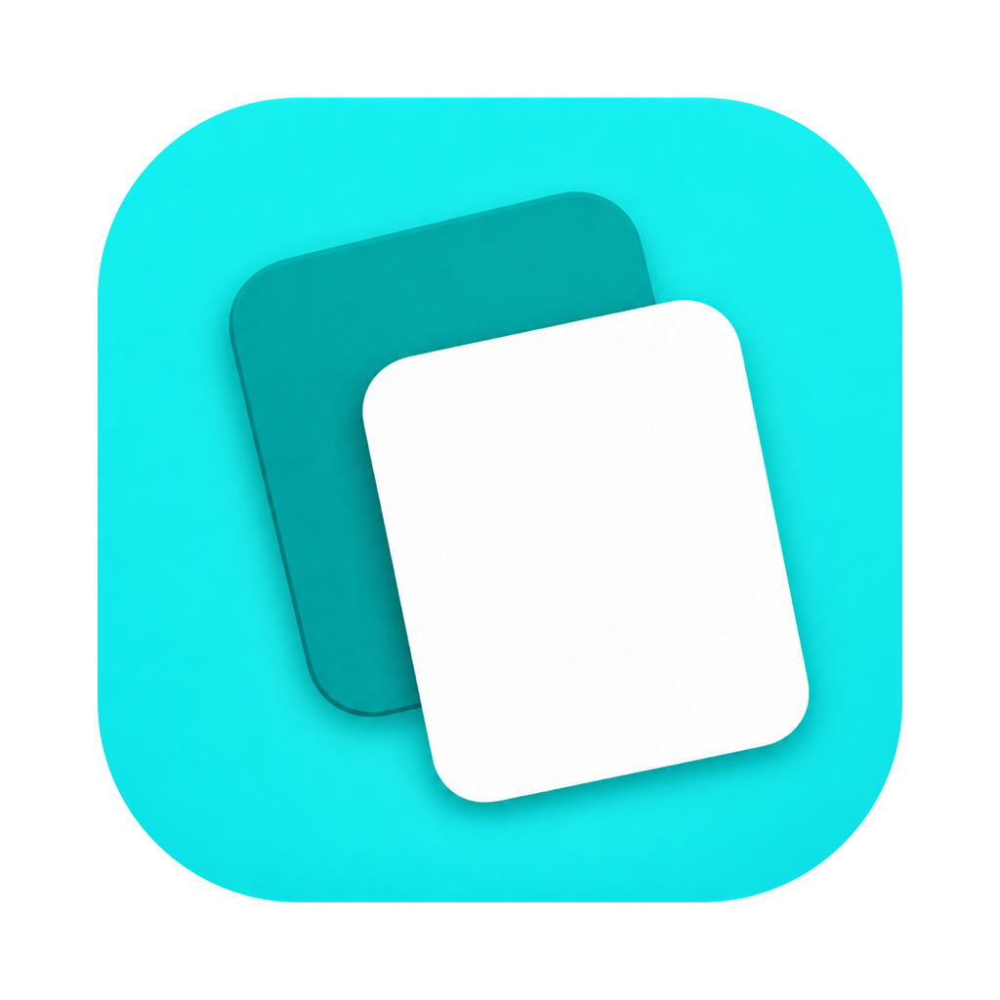
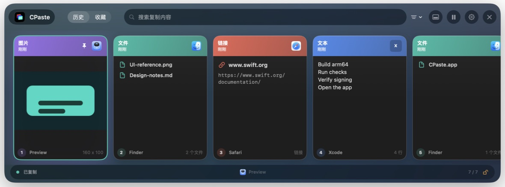
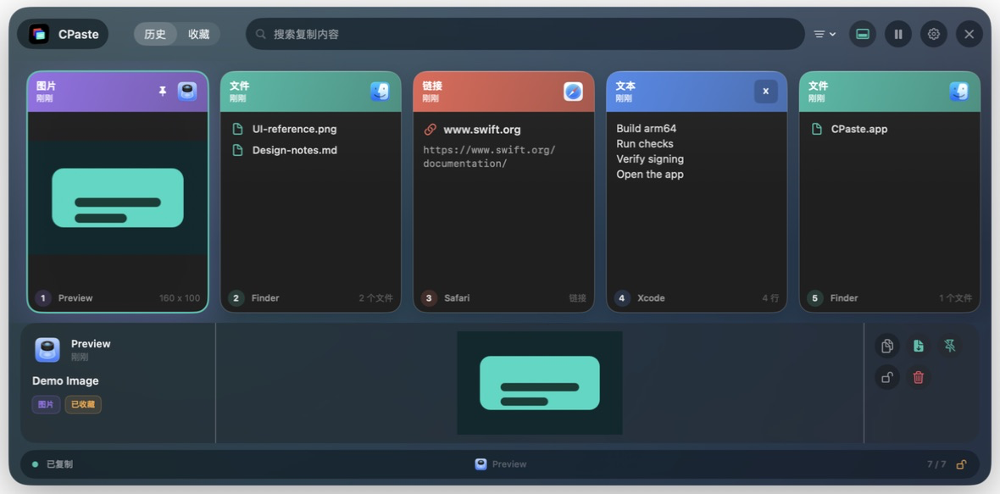
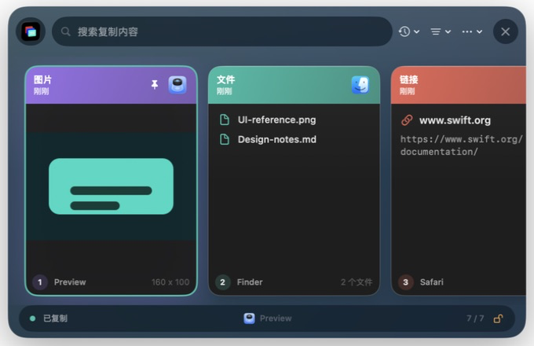
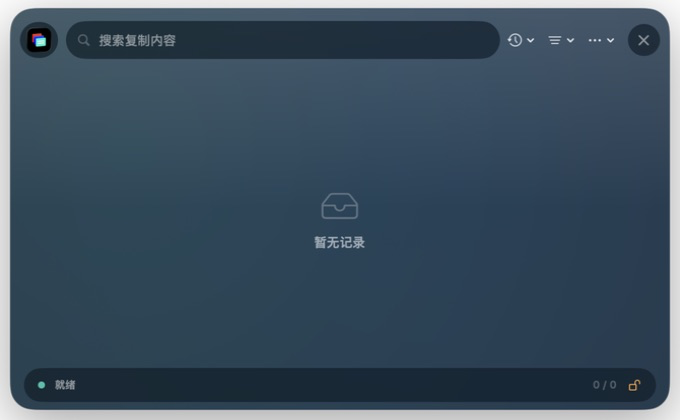
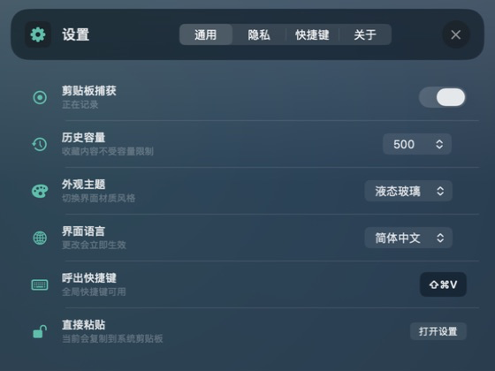
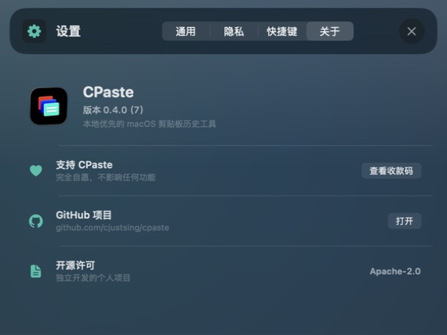
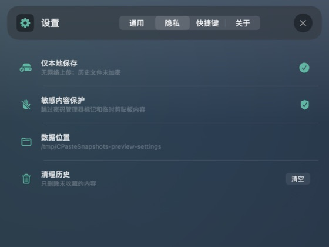

# CPaste User Guide

[简体中文使用说明书](CPaste-使用说明书.md)

Applicable version: CPaste `0.4.0 (7)`
System: macOS 13 or later; the Liquid Glass theme requires macOS 26 or later
Processor: Apple Silicon; the current release bundle is native `arm64`

## 1. Overview

CPaste is a local clipboard history app that lives in the macOS menu bar. It records text, links, files, and images, then presents them in a horizontal visual timeline for searching, previewing, pinning, and pasting again.

On macOS 26 or later, CPaste uses the system Liquid Glass theme by default and also offers the standard theme. Earlier macOS versions use the standard theme only.



Key capabilities:

- Open CPaste from any app with `Shift-Command-V`.
- Browse clipboard history as a horizontal timeline with content previews and source-app icons.
- Search instantly and filter by pinned state or content type.
- Use the mouse, trackpad, keyboard, context menus, or drag and drop.
- Paste automatically, paste as plain text, or copy only when Accessibility access is unavailable.
- Keep all history on this Mac without accounts, cloud sync, or network upload.

## 2. Install and Launch

### 2.1 Build the app

From the repository root, run:

```sh
swift build -c release --arch arm64
./scripts/build_app.sh
```

The app bundle is created at:

```text
build/CPaste.app
```

### 2.2 Launch

```sh
open build/CPaste.app
```

CPaste is a menu bar app and does not remain in the Dock.

### 2.3 Verify the Apple Silicon build

```sh
file build/CPaste.app/Contents/MacOS/CPaste
lipo -archs build/CPaste.app/Contents/MacOS/CPaste
```

The output should include:

```text
Mach-O 64-bit executable arm64
arm64
```

## 3. Permissions

| Action | Additional permission required |
| --- | --- |
| Record clipboard history | No |
| Copy a history item back to the system clipboard | No |
| Switch to the previous app and send `Command-V` automatically | Accessibility |

To grant Accessibility access:

```text
System Settings -> Privacy & Security -> Accessibility -> enable CPaste
```

Without this permission, Paste still copies the selected item to the system clipboard. You can then press `Command-V` in the destination app yourself.

## 4. Interface Overview



The screenshots in this guide use the Liquid Glass theme on macOS 26 and isolated demo data. They do not contain real clipboard history.

The main window has three layers:

| Area | Contents | Purpose |
| --- | --- | --- |
| Command bar | CPaste identity, History/Pinned scope, search, type filter, inspector, capture, settings, close | Controls the current view and app state |
| Timeline | Fixed-size cards in a horizontal scroller | Browses, selects, pastes, and drags history items |
| Status bar | Capture state, current source app, visible/total count, permission state | Confirms the current operating state |

### 4.1 Command bar

From left to right:

1. CPaste identity.
2. History / Pinned scope switcher.
3. Search field with immediate filtering.
4. Content-type filter for All, Text, Links, Files, and Images.
5. Inspector toggle for the selected item.
6. Pause or resume clipboard capture.
7. Open Settings.
8. Close the CPaste panel.

### 4.2 Timeline cards

Each card contains:

- A colored header showing content type, capture time, pin state, and source-app icon.
- A direct preview of text, a link, files, or an image.
- Position, source app, and content metadata in the footer.
- A teal outline and subtle lift when selected.

Visible positions 1 through 9 also map to `Command-1` through `Command-9` for quick paste.

## 5. Screenshots

These images are generated by the `0.4.0` release binary from onscreen windows. They use the same SwiftUI/AppKit views, data flow, and system Liquid Glass compositor as the shipping app.

### 5.1 Timeline overview


Use this view for quick browsing. Cards contain their primary preview, while the inspector stays collapsed.

### 5.2 Expanded inspector



The inspector includes:

- Source app, capture time, title, content type, and pin state.
- Complete text, image, file-path, or link content.
- Copy, Paste, Paste as Plain Text, Pin, Open, permission, and Delete actions.

The inspector is collapsed by default. Expanding it increases the panel height while keeping the timeline and card sizes stable.

### 5.3 Compact window



At a narrow width, CPaste keeps the horizontal timeline instead of switching to a different layout. Cards continue offscreen and remain horizontally scrollable; essential command-bar actions stay available.

### 5.4 Empty state



The empty state appears before any supported clipboard content has been captured. Copy text, a link, a file, or an image to create the first card.

### 5.5 Settings, About, Support, and Privacy



Settings controls capture state, history capacity, appearance, interface language, hotkey state, Accessibility access, local-data information, and app details.




The Privacy page describes local storage, sensitive-content filtering, the active data directory, and history cleanup.



### 5.6 Themes and materials

- On macOS 26 or later, Liquid Glass is the default. Choose Standard under Settings -> General -> Appearance Theme if preferred.
- On macOS versions earlier than 26, only the fully functional standard theme is shown.
- When Reduce Transparency is enabled, CPaste increases opaque background coverage and removes ambient color glows.
- When Reduce Motion is enabled, CPaste removes nonessential scrolling and lift animations.

### 5.7 Regenerate screenshots

```sh
swift build -c release --arch arm64
mkdir -p docs/screenshots/timeline-refactor
.build/arm64-apple-macosx/release/CPaste --snapshot-dir docs/screenshots/timeline-refactor
```

Native Liquid Glass screenshots require macOS 26 or later and Screen Recording permission for the process running the command. The renderer presents fixed-size isolated demo windows and writes PNG files from their WindowServer composition.

## 6. Open and Close CPaste

Open CPaste by:

- Pressing `Shift-Command-V`.
- Left-clicking the CPaste menu bar icon.
- Right-clicking the menu bar icon and choosing Show CPaste.

Close CPaste by:

- Pressing `Shift-Command-V` again.
- Pressing `Escape`. If search contains text, the first press clears it and the second closes the panel.
- Clicking the close button in the upper-right corner.
- Switching to another app.

Each time the panel opens, search is cleared, the timeline returns to the leading edge, and keyboard selection starts on a card. The History/Pinned scope and content-type filter remain selected.

## 7. Search, Scope, and Filtering

### 7.1 Instant search

Click the search field or press `Command-F`. Search covers:

- Item titles and complete text.
- File names and paths.
- Content types.
- Source-app names and bundle identifiers.

### 7.2 History and Pinned

- History shows all items with the newest first.
- Pinned shows pinned items only.
- Press `Option-1` for History or `Option-2` for Pinned.

Pinning does not change chronological order. Pinned items are preserved by Clear Unpinned History.

### 7.3 Content-type filter

| Type | Included content |
| --- | --- |
| All | Every supported item |
| Text | Plain and multiline text |
| Links | URLs with a scheme and host |
| Files | One or more files copied from Finder |
| Images | Clipboard images and supported temporary image files copied from chat apps |

When a type filter is active, a removable filter token appears in the search field.

## 8. Mouse and Trackpad

| Action | Result |
| --- | --- |
| Click a card | Select it |
| Double-click a card | Paste it |
| Scroll horizontally | Browse the timeline |
| Hover over a card | Show Copy, Pin, and Delete actions |
| Right-click a card | Open the full context menu |
| Drag a card to another app | Provide text, URL, file, or image data |

The context menu adapts to the selected content type and can include Paste, Paste as Plain Text, Copy, Open Link or Show in Finder, Pin, and Delete.

## 9. Keyboard Shortcuts

| Shortcut | Action |
| --- | --- |
| `Shift-Command-V` | Show or hide CPaste globally |
| `Command-F` | Focus search |
| `Option-1` / `Option-2` | Switch to History / Pinned |
| `Tab` | Move focus between search and the timeline |
| `Left` / `Up` | Select the previous card |
| `Right` / `Down` | Select the next card |
| `Command-Up` | Select the first card |
| `Command-Down` | Select the last card |
| `Return` | Paste the selected item |
| `Shift-Return` | Paste as plain text; images show a status message instead |
| `Command-1` ... `Command-9` | Paste visible item 1 ... 9 |
| `Command-C` | Copy the selected item only |
| `P` | Pin or unpin the selected item |
| `Space` | Expand or collapse the inspector |
| `Delete` | Delete the selected item |
| `Command-T` | Pause or resume capture |
| `Command-,` | Open Settings |
| `Escape` | Clear search or close the panel |

While editing search text, Left and Right move the text cursor. Press `Tab` or `Down` to enter the timeline, where the arrow keys select cards.

## 10. Copy, Paste, and Open

### 10.1 Paste

When you paste an item:

1. CPaste writes it to the system clipboard.
2. The item moves to the front of history.
3. With Accessibility permission, CPaste closes, returns to the previous app, and sends `Command-V`.
4. Without permission, the panel stays open and shows Copied.

### 10.2 Paste as plain text

- Text and links are written as unformatted strings.
- Files are written as newline-separated paths.
- Images are not converted because CPaste does not provide OCR.

### 10.3 Open an item

- Links open in the default browser.
- Files are revealed in Finder.
- Text and images have no direct Open action; copy, paste, or drag them instead.

## 11. Pin and Delete

Pin or unpin an item by:

- Selecting it and pressing `P`.
- Clicking the pin button shown on hover.
- Clicking the pin button in the inspector.
- Choosing Pin or Unpin from the context menu.

Delete one item by pressing `Delete`, clicking a trash button, or using the context menu. After deletion, CPaste keeps selection near the removed position instead of jumping back to the beginning.

Clear unpinned history from Settings -> Privacy -> Clear History, or from the menu bar context menu. CPaste asks for confirmation and always preserves pinned items.

## 12. Settings

### 12.1 General

| Setting | Description |
| --- | --- |
| Clipboard Capture | Pausing prevents new clipboard items from being saved |
| History Capacity | 50, 100, 500, or 1000 items; pinned items are preserved |
| Appearance Theme | Liquid Glass / Standard on macOS 26 or later; Standard only on earlier systems |
| Interface Language | System, 简体中文, or English; changes apply immediately |
| Global Hotkey | Shows whether `Shift-Command-V` registered successfully |
| Direct Paste | Shows Accessibility state and opens System Settings |

### 12.2 Privacy

The Privacy page shows that:

- All data stays on this Mac.
- Password-manager, concealed, transient, and auto-generated clipboard content is skipped.
- History files are not encrypted at the application layer.
- The actual active data directory is displayed.
- Unpinned history can be cleared.

### 12.3 Shortcuts

The Shortcuts page groups all supported keys into Browse and Actions columns. It matches the table in section 9.

### 12.4 About and Support

About displays the CPaste version, project purpose, and Apache-2.0 license. View Payment Codes opens locally bundled Alipay or WeChat Pay QR codes.

Support is entirely optional. It does not unlock features or affect use, support, or future updates. CPaste does not record support activity or send a network request for it.

## 13. Menu Bar

Left-click the menu bar icon to show or hide the timeline. Right-click it to open:

| Menu item | Action |
| --- | --- |
| Show CPaste | Open the timeline; shortcut `Shift-Command-V` |
| Pause/Resume Capture | Toggle monitoring; shortcut `Command-T` |
| Clear Unpinned History | Preserve pinned items and delete the rest |
| Accessibility Settings | Open the relevant system permission page |
| Quit CPaste | Exit the app |

## 14. Content and Source Apps

### 14.1 Text

CPaste stores the complete string. Cards preview multiline content, and text in the inspector can be selected.

### 14.2 Links

CPaste stores the URL string, emphasizes its host on the card, and opens it in the default browser.

### 14.3 Files

CPaste stores one or more file URLs. Cards show file names, the inspector shows full paths, and plain-text paste outputs a path list.

### 14.4 Images

Images are stored as local PNG blobs and shown proportionally in the timeline and inspector.

### 14.5 Source apps

At capture time, CPaste records the foreground app name and bundle identifier and displays its icon. Source fields are searchable. If the app is unavailable or its icon cannot be read, CPaste shows an initial badge.

## 15. Storage and Privacy

Default directory:

```text
~/Library/Application Support/CPaste
```

| Path | Contents |
| --- | --- |
| `history.json` | Text, URLs, file paths, source app, timestamps, and pin state |
| `Blobs/*` | Images and PDF content saved from the clipboard |

CPaste skips clipboard data marked concealed, transient, auto-generated, or associated with supported password managers. Storage permissions restrict files to the current user, but contents are not encrypted at the application layer. CPaste contains no network upload implementation. Lowering history capacity immediately removes the oldest unpinned items as needed.

## 16. Isolated Demo Mode

To inspect the complete interface without touching real history:

```sh
CPASTE_STORAGE_DIR="$(mktemp -d /tmp/cpaste-demo.XXXXXX)" build/CPaste.app/Contents/MacOS/CPaste --demo
```

Demo mode creates text, link, file, and image items with Xcode, Safari, Finder, and Preview source information.

## 17. Troubleshooting

### 17.1 `Shift-Command-V` does nothing

- Confirm CPaste is running and visible in the menu bar.
- Left-click the menu bar icon as an alternative.
- Check Global Hotkey in Settings. If unavailable, disable or change the conflicting shortcut in the other app.

### 17.2 Paste only copies and does not switch apps

This is the normal fallback without Accessibility permission. Click the orange lock in the status bar or Open Settings on the General page, then enable CPaste in Accessibility.

### 17.3 Newly copied content does not appear

- Resume capture if the command bar currently offers Resume Capture.
- Clear search and the content-type filter.
- Switch back to History.
- Test again with plain text, a URL, a Finder file, or an image.

### 17.4 An image says Preview Unavailable

Its local blob may have been removed externally. You can still delete the metadata; copying the source image again creates a new local blob.

### 17.5 Delete all local data

Quit CPaste, then delete `~/Library/Application Support/CPaste`. This action is irreversible and also deletes pinned items.

### 17.6 Liquid Glass is not offered

Liquid Glass uses system APIs introduced in macOS 26. CPaste hides that option and uses the standard theme on macOS 25 and earlier.

## 18. Maintenance and Verification

Run the complete quality gate:

```sh
./scripts/quality_gate.sh
```

It covers:

- Core behavior checks.
- A release `arm64` build.
- App bundle and `Info.plist` validation.
- Mach-O architecture and code-signature verification.

## 19. Known Limitations

- The current build uses local ad-hoc signing and is not notarized with a Developer ID.
- Automatic paste requires the user to grant Accessibility permission.
- CPaste stores plain strings, URLs, file URLs, and PNG images; it does not preserve every original rich-text or HTML representation.
- CPaste does not include OCR, iCloud, multiple pinboards, team sharing, or synchronization.
- Liquid Glass is available only on macOS 26 or later; earlier systems use the standard theme.
