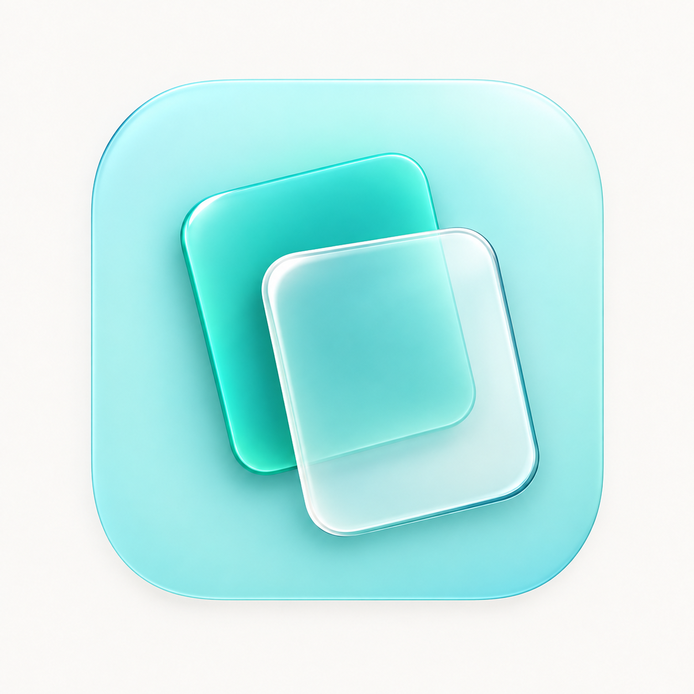

# CPaste 图标设计方向

2026-09-29 用户选定：保留液态玻璃方向的第二版。

这里的“第二版”指明亮液态玻璃方向的第二次草案：后层卡片的轮廓可以透过前层看见。它不是最初三版探索中的第二个纸张方案，也不是第一次浅色毛玻璃草案。

## 已选定的设计要素

- 布局沿用最初第一版：两张圆角卡片错位叠放，后层偏左上、前层偏右下，保留原有倾斜角度和留白。
- 配色明亮，使用浅青绿底与青绿色后层卡片，避免深海军蓝底色带来的沉重感。
- 材质采用清透的液态玻璃方向，前层可透出后层的颜色和轮廓，以边缘折射和高光表现层次。
- 卡片保持空白，延续简洁、轻盈的造型。

## 文件与用途

- 选定稿：`liquid-glass-v2.png`，1254 × 1254，静态视觉参考。
- 本稿是生产图标的唯一图像源。使用 `swift scripts/generate_app_icon.swift` 从原图裁切外部展示背景、应用抗锯齿透明蒙版并等比例缩放，生成 `Resources/AppIcon/AppIcon-1024.png`、完整 iconset 和 `CPaste.icns`。
- 正式资源保留原稿内部的颜色、卡片和玻璃细节；不得用生成式编辑重绘选定稿。两次生成式抠图结果因质量下降已弃用，不进入应用资源。
- 当前通过静态 `.icns` 提供选定的液态玻璃视觉效果，并兼容 macOS 13 及以上版本。
- 菜单栏采用对应的双卡片单色模板，由系统适配深浅背景。

## 生成来源

- 使用内置 imagegen 工具生成。
- 参考：最初第一版双卡片布局，以及 [Apple Icon Composer](https://developer.apple.com/icon-composer/) 的官方图标材质示例。
- 生成文件标识：`exec-9a656ca9-f744-416c-92d6-7c06d8b04b6c.png`。
- 提示词要点：精确保留双卡片位置、大小、倾斜和重叠关系；明亮浅青绿底色；后层为青绿透明材质，前层为高透光无色玻璃；重叠处必须看清后层卡片边界；通过精细边缘折射和清晰高光表现 Liquid Glass；去掉乳白雾化、纸张纹理、粗厚倒角与文字装饰。
