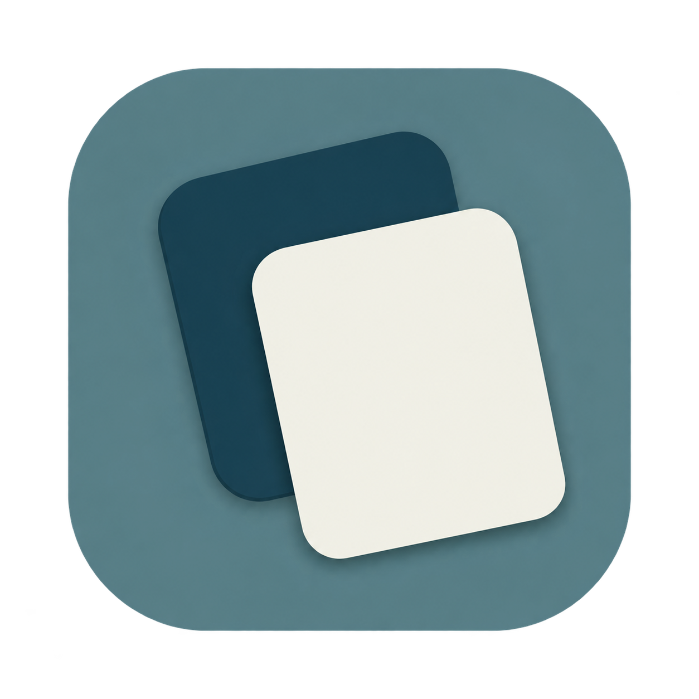

# 明暗对比双卡片设计记录

2026-09-29，根据用户关于小尺寸图标亮色过多、层次不足的反馈重新设计。

状态：用户已选定，从 0.4.6（13）起用于应用图标。



## 设计目标

- 保留双卡片的错位、倾斜、大小与空白卡面。
- 背景使用中等明度、低饱和度的灰青色，后卡片改为明显更深的青蓝色，前卡片采用柔白色。
- 通过中、深、浅三个明度层次提高 24–32 px 工具栏尺寸下的辨识度。
- 保持不透明实色与轻阴影，避免荧光青绿、玻璃折射、透明卡面和强高光。

## 原稿与检查

- `contrast-cards-v2.png` 保存内置 imagegen 返回的原始文件，不做生成式抠图或连续重绘。
- 生成文件标识：`exec-9fe18f71-da91-47c1-ba53-1205d6cbf333.png`。
- 输入参考：当前实色双卡片图标，以及用户提供的 CPaste 工具栏截图。
- 原稿保持不变；生产打包由 `scripts/generate_app_icon.swift` 处理正方形底板、内部 alpha 和外缘。检查 32 px、64 px 资源、应用内图标与系统读取的已安装图标。

## 生成提示词

```text
Use case: logo-brand / precise-object-edit.
Create a redesigned CPaste macOS app icon, a single square 1024 x 1024 image with transparent exterior.
Image 1 is the existing production icon: preserve its exact two blank portrait-card shapes, layout, tilt, size, overlap and rounded-square tile composition. Image 2 is the user's real small toolbar screenshot, only a usability reference: the current luminous cyan and white look washed out at 24–32 px. Do not reproduce this UI or its other content.
Change the color and tonal hierarchy decisively. Tile: muted medium-value gray teal, centered around #557C83, with at most a very restrained broad tonal variation. Rear upper-left card: substantially darker ink teal-blue #173B49, with a clear crisp silhouette distinct from the tile. Front lower-right card: opaque soft ivory-white #F1F1E9, clean and bright but not glowing. It is the only light focal shape. Keep a generous clearly visible dark portion of the rear card around the front card. The three value levels must read instantly at 24 px: medium tile, dark rear, light front.
Appearance: elegant, quiet, precise, opaque flat color planes with the faintest short contact shadow. Smooth untextured surfaces. Preserve all card geometry and the empty card faces. Keep the tile medium in brightness; do not make the entire background very dark, near-black or navy. Avoid turquoise neon, electric cyan, oversaturated mint, shiny glass, translucent cards, reflections, glows, milky highlights, bevels, metallic outlines, noise, grain, heavy shadows or inflated plastic. No letters, text lines, symbols, badges, labels, presentation board, UI mockup or alternative icons.
Technical: centered icon with about 10% transparent padding, clean smooth antialiased outer silhouette. The tile and every pixel within it should be fully opaque; alpha transparency is only outside the outer tile. Produce one pristine icon concept.
```
